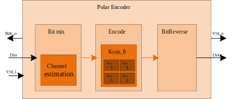
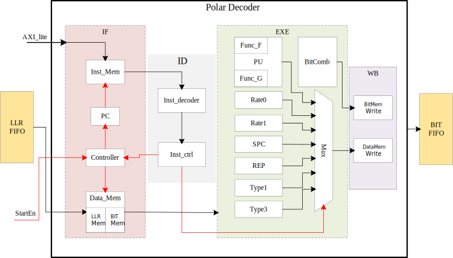

# Polar code

A Polarcode Encoder and Decoder

## Background

low_power & short code wireless communication

- Code Length: 256
- Code Rate: 0.5

## Where

- `./doc`: some references
- `./encode`: Encoder related code
- `./decode`: Decoder related code
- `./matlab`: Algorithm simulation code - matlab
- `./pysrc` : Algorithm simulation code - python
- `./qt5_prj`: GUI file (UNDONE, Todo ...)

## Feature

### Encoder

- 3-stage pipeline
- Polarization weight(PW)
- Non-systematic encoding

### Decoder

- Fast-SSC deocde algorithm
- Harvard architecture
- Custom ISA

## Tools

- [verilator](https://github.com/verilator/verilator)
- [GTKwave](https://github.com/gtkwave/gtkwave)